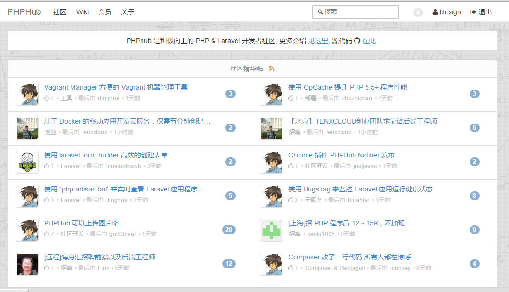
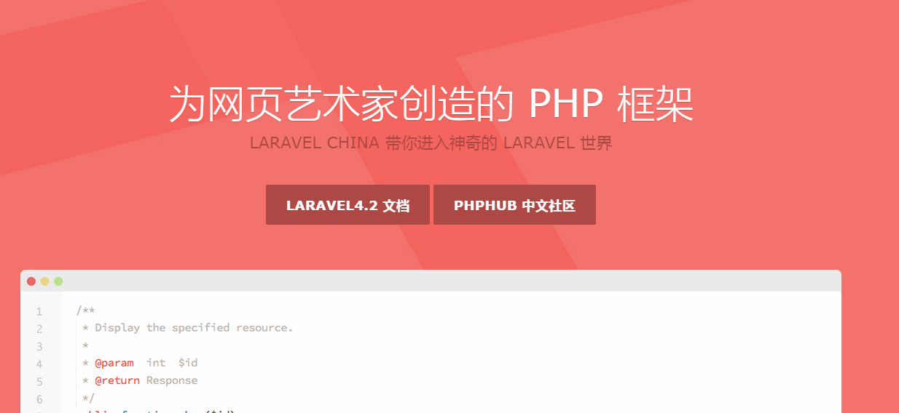
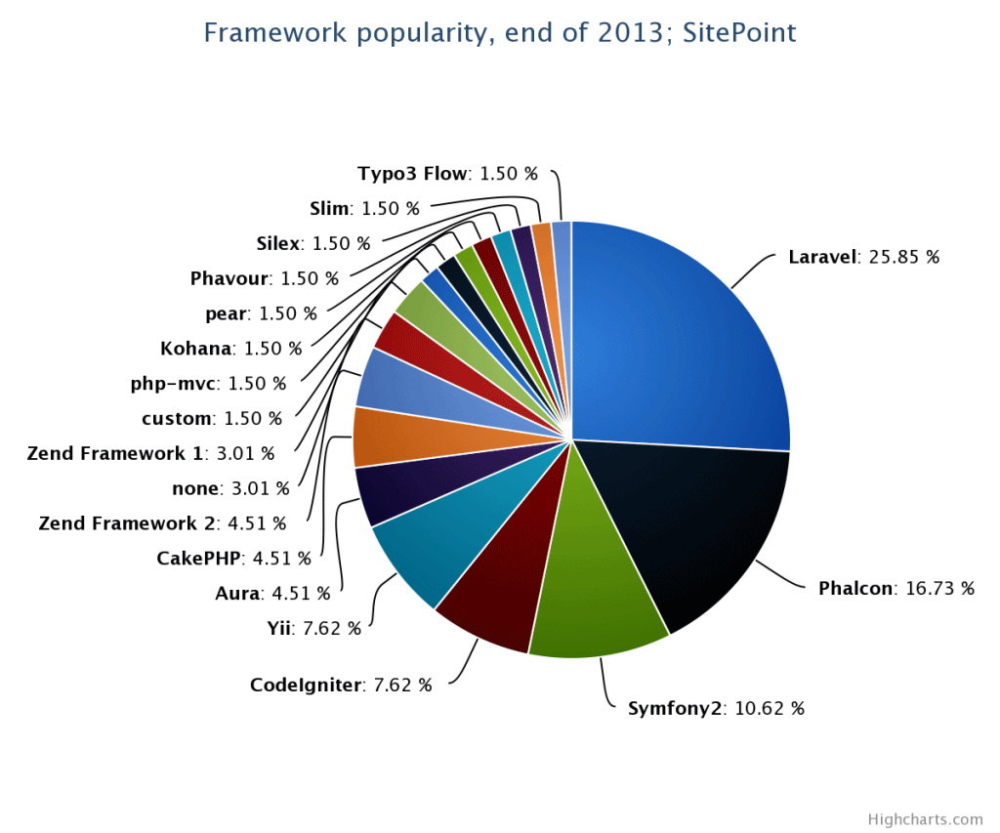
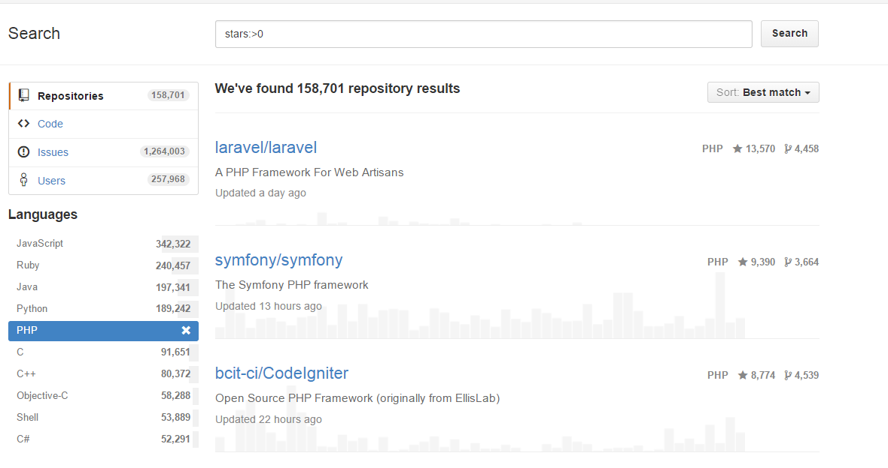
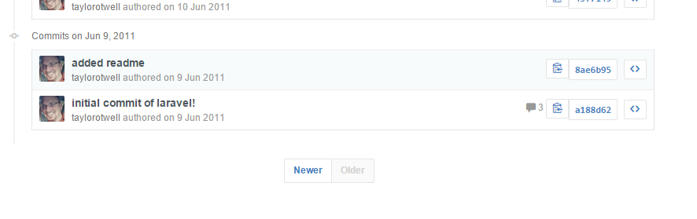
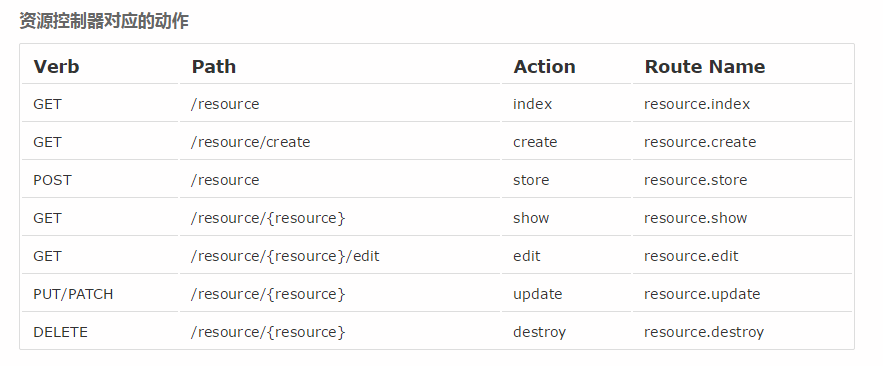
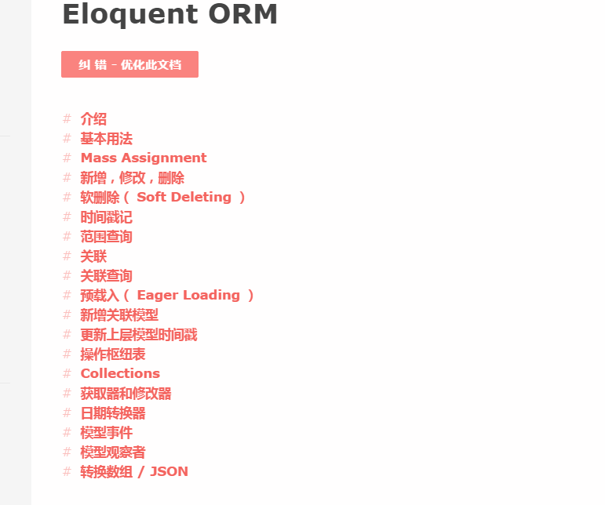
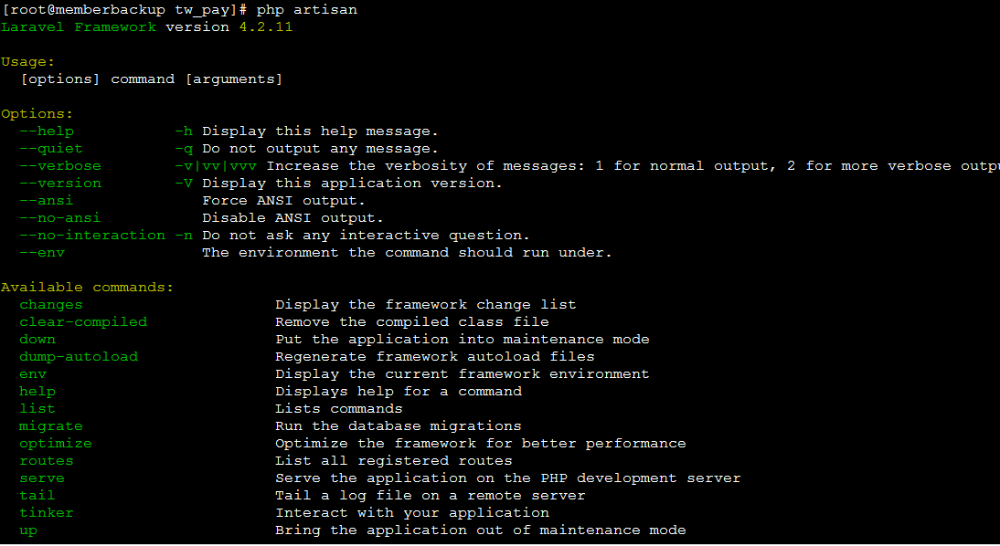
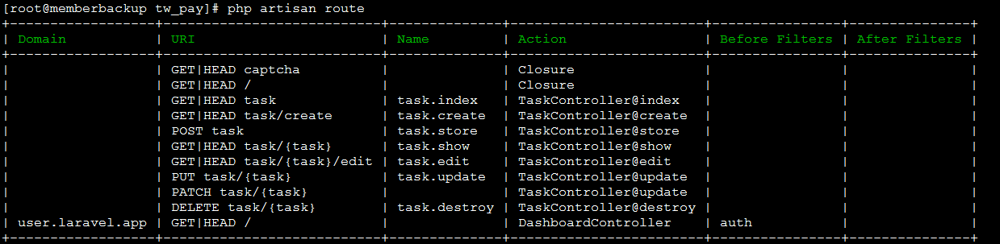

## [PHPhub](http://phphub.org) 社区



--<n>--

## [Laravel-china.org](http://laravel-china.org)



--<n>--

## laravel 现状

2014年php开发框架流行度排名



--<n>--

Github Star

 

--<n>--

First Commit

 <!-- .element: style="width: 200%;" -->

--<n>--

Author: Taylor Otwell <!-- .element: style="font-size: 2em" -->


--<n>--

<!-- 这里可以用section -->

###发布里程 <!-- .element: style="margin-left: 200px;" -->

- 2011年6月  1.0.0 Beta<!-- .element: class="fragment" data-fragment-index="1" -->
- 2011年11月 2.0发布 <!-- .element: class="fragment" data-fragment-index="2" -->
- 2013年5月  3.2发布 <!-- .element: class="fragment" data-fragment-index="3" -->
- 2013年12月 4.0发布 <!-- .element: class="fragment" data-fragment-index="4" -->
- 到目前为止最新版本是4.2.11 <!-- .element: class="fragment" data-fragment-index="5" -->

....  <!-- .element: class="fragment" data-fragment-index="6"-->

--<n>--

##  2015年1月 laravel5  <!-- .element: class="fragment" data-fragment-index="8"-->
<!-- .element: class="fragment" data-fragment-index="9" style="width: auto; height: 600px;" -->

--<n>--


## 「Laravel特点」

<blockquote>
    &ldquo;Laravel是一个简单优雅的PHP Web开发框架，可以将开发者从意大利面条式的代码中解放出来，通过简单、高雅、表达式语法开发出很棒的Web应用，Laravel拥有更富有表现力的语法、高质量的文档、丰富的扩展包，被称为“巨匠级PHP开发框架”。&rdquo;
</blockquote> <!-- .element: style="width: 80%" -->

--<n>--

 <!-- .element: style="width: 80%" -->

--<n>--

## 特色简介

--<n>--

<!-- .slide: data-background="assets/img/polygon_green.jpg" class="bg-inverse" data-background-transition="zoom" data-transition="fade"-->

- 强大的路由系统 <!-- .element: style="font-size: 2em" -->
- 合理的 ORM model 层, Eloquent ORM <!-- .element: style="font-size: 2em" -->
- Blade 模板引擎 <!-- .element: style="font-size: 2em" -->
- migration 数据库版本系统 和 seeding <!-- .element: style="font-size: 2em" -->
- artisan命令行工具, 高度自动化 <!-- .element: style="font-size: 2em" -->
- 使用包管理器 Composer 扩展 <!-- .element: style="font-size: 2em" -->
- 强调测试驱动, 高质量代码 <!-- .element: style="font-size: 2em" -->

--<n>--

<!-- .slide: data-background="assets/img/route4.jpg" class="bg-inverse" data-background-transition="zoom" data-transition="fade"-->

##Route System

- Routing for basic static pages
- Passing parameters to functions
- Using named routes to make URLs easier to use
- Filtering routes for Auth or anything else
- Group routing
- Routing to Controller
- Resource Route

--<d>--

## 先来一个最基本的路由

```
// app/routes.php
Route::get('/', function(){
    return View::make('hello');
})
```

其他请求呢? <!-- .element: class="fragment" data-fragment-index="1" style="margin-top: 20px;" -->

```
Route::post('foo/bar', function(){
    return 'Post Request';
})

Route::any('foo', function(){
    return 'Any Request';
});
```
<!-- .element: class="fragment" data-fragment-index="2" -->

--<d>--

## 路由参数

很多时候往往路由不是静态的地址, 而是带有动态的参数. 比如`blog/{$category}`

```
Route::get('blog/{category}', function($category){
    return "Finding Post in {$category}";
});
```

可选参数<!-- .element: class="fragment" data-fragment-index="1" style="margin-top: 20px;" -->

```
Route::get('blog/{category?}', function($category = null){
    if ($category)
        //fetch blogs in this category
    else 
        //fetch all blogs

    return View::make('blog', /* $blogs */);
});
```
<!-- .element: class="fragment" data-fragment-index="2" style="margin-top: 20px;" -->

--<d>--


##命名路由
顾名思义是给路由进行命名, 有什么好处呢?

```
Route::get('user/{id}', ['as' => 'user.detail', function($id){
   // 
}]);

```
<!-- .element: class="fragment" data-fragment-index="1" style="margin-top: 20px;" -->

- 生成重定向跳转 <!-- .element: class="fragment" data-fragment-index="2" style="margin-top: 50px;" -->
`Redirect::route('user.detail', $id);`
- 生成 url <!-- .element: class="fragment" data-fragment-index="3" style="margin-top: 20px;" -->
`route('user.detail', $id)` -> "http://domain/user/$id"

--<d>--

##路由过滤

```
//define filter
Route::filter('login', function()
{
    // Some Logic check if the current user is login
});
```

在特定的路由前进行过滤 使用 before 关键字<!-- .element: style="margin-top: 20px;" -->
```
Route::get('money', ['before' => 'login', function(){
    // see user's money
}]);
```

--<d>--

##群组路由

如果不想为每个路由定义相同的过滤器, 我们可以采用群组路由的方式

```
Route::group(['before' => 'csrf'], function(){

    Route::post('login', function(){});

    Route::post('user/profile', function(){});
});

```

--<d>--

##控制器路由

```
Route::get('user/{id}', 'UserController@showProfile');

```

控制器<!-- .element: style="margin-top: 20px;" -->

```
class UserController extends BaseController {

    /**
     * Show the profile for the given user.
     */
    public function showProfile($id)
    {
        $user = User::find($id);

        return View::make('user.profile', ['user' => $user]);
    }

}
```

--<d>--

##资源控制器

`Route::resource('photo', 'PhotoController');`

<!-- .element: style="width: 200%;" -->

--<n>--


## Eloquent ORM

<blockquote>
Laravel 的 Eloquent ORM 提供了漂亮、简洁的 ActiveRecord 实现来和数据库的互动。 每个数据库表会和一个对应的「模型」互动。    
</blockquote>
<!-- .element: style="line-height: 40px;" -->

--<d>--

## Eloquent ORM <small>——CRUD Example </small><!-- .element: style="vertical-align: middle; " -->
<!-- .element: style="text-align: left; padding-left: 1em;" -->

```
// 获取所有任务记录
$tasks = Task::all();
 
// 获取ID为1的任务
$task = Task::find(1);
 
// 更新ID为1的task
$task = Task::find(1);
$task->title = 'Finish Homework';
$task->save();
 
// 创建一条任务
Task::create([
    'title' => 'Write article'
]);
 
// 删除任务
Task::find(1)->delete();

```

--<d>--

## Eloquent ORM
### Relationship <!-- .element: style="text-align: center;" -->

- 一对一
- 一对多
- 多对多

--<d>--

One To One Example

```
class User extends Eloquent {

    public function phone()
    {
        return $this->hasOne('Phone');
    }

}

$phone = User::find(1)->phone;

```
<br/><br/><br/>
SQL执行

```
select * from users where id = 1

select * from phones where user_id = 1
```

--<d>--

One To Many Example

```
class Task extends Eloquent {

    public function user()
    {
        return $this->belongsTo('User');
    }

}
```

```
class User extends Eloquent {

    public function tasks()
    {
        return $this->hasMany('Task');
    }

}
```

```
// Get all tasks by the author with an id of 1
$tasks = User::find(1)->tasks;
 
// Get the author of a task
$author = Task::find(5)->user()->username;
 
// Insert a new task by author
$task = new Task([ title: 'Go to store.' ]);
User::find(1)->tasks()->insert($task);
```

--<d>--

## Eloquent ORM <small>——Mass-assignment</small><!-- .element: style="vertical-align: middle; " -->
<!-- .element: style="text-align: left; padding-left: 1em; text-transform: none;" -->


```
//需要手动指定一堆的键值 为的是预防多余字段插入
News::create([
    'title' => Input::get('title'),
    'slug' => Input::get('slug'),
    'content' => Input::get('content'),
    'published_at' => Input::get('published_at'),
])

```
一个常见的场景 <!-- .element: style="text-align: center; font-size:1em; margin-top: 80px;" -->

--<d>--

有没有更简单直观的做法呢?

 <!-- .element: style="width: 200%" -->

--<d>--

通过定义fillable属性 - "白名单"  <!-- .element: style="text-align: center; font-size: 1em;"  -->

```
class News extends Eloquent {

    protected $fillable = array('title', 'slug', 'content', 'published_at');

}
```
<!-- .element: class="fragment" data-fragment-index="1" -->


定义Guarded属性 - "黑名单" <!-- .element: class="fragment" data-fragment-index="2" style="text-align: center; margin-top: 30px; font-size: 1em;"  -->

```
class News extends Eloquent {

    protected $guarded = array('id');

}
```
<!-- .element: class="fragment" data-fragment-index="3" -->


Finally: <!-- .element: class="fragment"  data-fragment-index="4" style="text-align: center; font-size: 1.5em; margin-top: 20px;"  -->

```
News::create(Input::get());

```
<!-- .element: class="fragment" data-fragment-index="5" -->

--<d>--

<!-- .element: style="width: 200%" -->

--<d>--

##Model Events

- Eloquent 模型中定义了很多的事件, 使得我们可以在模型操作的生命周期的不同时间点, 通过以下方法绑定事件`creating` 、 `created` 、 `updating` 、 `updated` 、 `saving` 、 `saved`、 `deleting` 、 `deleted` 、 `restoring` 、 `restored` 。
- 当一个对象被创建时, `creating` 和 `created` 事件会被触发。如果是更新对象, `updating` / `updated` 事件会被触发。而两者的 `saving` / `saved` 事件都会触发。

--<d>--

###Model Events Example <!-- .element: style="text-align: left; padding-left: 60px;" -->

`Eloquent_Model_Name::Event_Name(callback)`

```
//创建或者修改post模型的时候自动加入编辑的人的id

Post::creating(function($post)
{
    $post->created_by = Auth::user()->id;
    $post->updated_by = Auth::user()->id;
});

Post::updating(function($post)
{
    $post->updated_by = Auth::user()->id;
});

//删除图片
Image::deleting(function($image)
{
    if (count($image->galleries)) return false;
});

```

--<d>--


###Model Observer Example <!-- .element: style="text-align: left; padding-left: 60px;" -->

<p>
如果我们对一个模型注册了很多的事件, 可以为这个模型单独注册一个模型的观察者。
</p>
<!-- .element: style="text-align: left; padding-left: 60px;" -->

```
class UserObserver {
    public function creating($model) {}
    public function updating($model) {}
    public function saved($model)    {}
}

```

<p>
使用 `observe` 方法注册一个观察者的实例 `User::observe(new UserObserver)`    
</p>
<!-- .element: style="text-align: left; padding-left: 60px;margin-top: 60px;" -->

--<d>--

## Setter And Getter

`允许动态的对模型进行获取和修改`

### Getter<!-- .element: style="text-align: left; padding-left: 60px;" -->
```
class User extends Eloquent {

    public function getFirstNameAttribute($value)
    {
        return ucfirst($value);
    }

}

echo User::find(1)->firstName; // jack->Jack

```

### Setter<!-- .element: style="text-align: left; padding-left: 60px; margin-top:20px;" -->

```
class User extends Eloquent {

    public function setPasswordAttribute()
    {
        return md5( $this->password );
    }
}

```

--<d>--

##更多用法

[官方文档](http://laravel-china.org/docs/eloquent)



--<n>--


##Blade模板引擎

<p>
"Laravel 所提供的一个简单却又非常强大的模板引擎。Blade 是使用 模板继承（template inheritance） 及 区块（sections） 来创建出视图。所有的 Blade 模板的后缀名都要命名为 .blade.php。"    
</p>
<!-- .element: style="rgb(90, 49, 40);" -->


### 一个简单的layout <!-- .element: style="text-align: center" -->

```
<!-- Stored in app/views/layouts/master.blade.php -->

<html>
    <body>
        @include('layouts.partial.nav')

        @section('sidebar')
            This is the master sidebar.
        @show

        <div class="container">
            @yield('content')
        </div>
    </body>
</html>
```

--<d>--

##继承布局

```
@extends('layouts.master')

@section('sidebar')
    <!-- 如果需要调用父类的section 用@parent关键字 -->
    @parent

    <p>This is appended to the master sidebar.</p>
@stop

@section('content')
    <!-- {{}} 输出变量  {{{}}}过滤内容中的 HTML 字符串实体 -->
    Hello, {{ $name }}. {{{age}}}
    <p>This is my body content.</p>
@stop

```

--<d>--

##其他控制语法

```
@if (count($records) === 1)
    I have one record!
@elseif (count($records) > 1)
    I have multiple records!
@else
    No Records.
@endif


@for ($i = 0; $i < 10; $i++)
    The current value is {{ $i }}
@endfor

@foreach ($users as $user)
    <p>This is user {{ $user->id }}</p>
@endforeach

@while (true)
    <p>looping forever.</p>
@endwhile

```

--<n>--

## Migrations & Seeds

- `Migrations: 数据库的版本控制`
- `Seeds: 数据导入`

--<d>--


来个栗子

`php artisan migrate:make create_users_table --table=users --create`


```
<!-- store in app/database/migrations/2014_12_19_095403_create_users_table -->
<?php

use Illuminate\Database\Schema\Blueprint;
use Illuminate\Database\Migrations\Migration;

class CreateUsersTable extends Migration {

    
    public function up()
    {
        Schema::create('users', function($table)
        {
            $table->increments('id');
            $table->string('name');
            $table->integer('age');
            $table->timestamps();
        });
    }
   
    public function down()
    {
        Schema::drop('users');
    }

}

```
<!-- .element: style="text-align: left;margin-bottom: 60px;" -->

执行操作 `php artisan migrate` 

执行回滚 `php artisan rollback`

重置操作 `php artisan reset`


--<d>--

##Seed Example

```
//入口
class DatabaseSeeder extends Seeder {

    public function run()
    {
        //调用UserTableSeeder的run方法 一个表一个seeder
        $this->call('UserTableSeeder');
        // $this->call('OtherTableSeeder');

        $this->command->info('User table seeded!');
    }

}

//使用faker作为假数据生成器
use Faker\Factory as Faker;

class UserTableSeeder extends Seeder {

    public function run()
    {   
        $faker = Faker::create();

        foreach(range(1, 50) as $index)
        {
            User::create([
                'github_id'        => $index,
                'github_url'       => $faker->url(),
                'city'             => $faker->city(),
                'name'             => $faker->userName(),
                'introduction'     => $faker->sentence(),
                'email'            => $faker->email(),
            ]);
        }
    }

}

```

<p>执行: `php artisan db:seed`</p>
<!-- .element: style="text-align: left; margin-top: 60px; padding-left: 65px;" -->

--<n>--

## Artisan 命令行工具

<!-- .element: style="width: 200% "-->

--<d>--

### 查看当前路由<!-- .element: style="padding-left: 30px; "-->


`php artisan route`<!-- .element: style="line-height: 50px; "-->

<!-- .element: style="width: 200%; height: 450px;"-->

--<d>--

##Other Useful Command
- `php artisan down`  进入维护模式 (`php artisan up` 可恢复)
- `php artisan tinker` 内置的repl模式 可以直接进行数据库操作
- `php artisan serve` 开启内置server
- `php artisan tail` 实时查看laravel的log

--<n>--


## [使用Composer扩展](http://getcomposer.org)

<blockquote>
是 PHP 用来管理依赖（dependency）关系的工具。你可以在自己的项目中声明所依赖的外部工具库（libraries），Composer 会帮你安装这些依赖的库文件。
</blockquote>

--<d>--

## 关于安装

```
php >= 5.3.2 openssl √ (win下使用php套件的同学注意多个php.ini问题)

$ curl -sS https://getcomposer.org/installer | php
$ mv composer.phar /usr/local/bin/composer
$ composer

 / ____/___  ____ ___  ____  ____  ________  _____
 / /   / __ \/ __ `__ \/ __ \/ __ \/ ___/ _ \/ ___/
/ /___/ /_/ / / / / / / /_/ / /_/ (__  )  __/ /
\____/\____/_/ /_/ /_/ .___/\____/____/\___/_/
                    /_/
Composer version d79f2b0fd33ee9b89f3d9f1969f43dc3d570a33a 2014-09-10 15:11:05

Usage:
  [options] command [arguments]
...

```

--<d>--


## 简明三步教程 

###在项目目录中创建 composer.json 文件, 比如 [Monnolog](https://github.com/Seldaek/monolog) 
<!-- .element: style="text-align: center;margin-top:20px;"-->

```
{
    "require": {
        "monolog/monolog": "1.2.*"
    }
}
```

###安装依赖<!-- .element: style="text-align: center;margin-top: 50px;"-->

在项目目录中执行 `composer install`

###引入自动加载<!-- .element: style="text-align: center; margin-top: 50px;"-->

在代码初始化的部分引入下面的代码:

`require 'vendor/autoload.php'`

--<d>--

##Other Thing

1. [packagist.org](https://packagist.org/) 是 [Composer](http://getcomposer.org) 的官方仓库, 一些知名的PHP库都能在其中找到, 也可以提交自己的类库。
2. 被墙可以考虑使用[Composer国内镜像](http://pkg.phpcomposer.com/)
3. 公司内部可使用[Satis](https://github.com/composer/satis)
4. 使用[Toran](https://toranproxy.com/)自建镜像

--<n>--


## What Else?

- [官方文档](http://laravel.com/docs)
- [中文文档](http://laravel-china.org/docs)
- [交流社区](http://phphub.org)
- [问答社区](http://wenda.golaravel.com)
- [项目源码参考](https://phphub.org/topics/8)
- [视频集锦](https://phphub.org/topics/14)
- [相关站点](https://phphub.org/topics/13)
