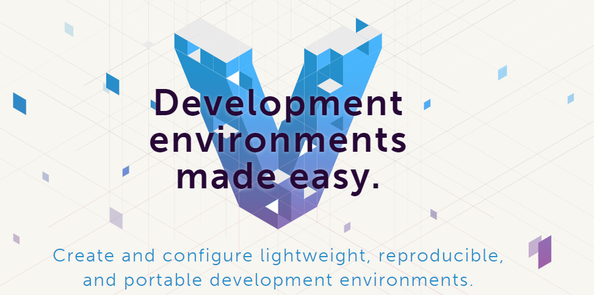

<!-- .slide: data-background="assets/img/light.jpg" class="bg-inverse" data-background-transition="zoom" data-transition="fade"-->

# 关于学习框架的一些建议

- 关注web开发领域
- 标准化
- 从最熟悉的开始
- 善用工具
- 阅读经典书籍

--<n>--


<!-- .slide: data-background="assets/img/jet-sky.jpg" class="bg-inverse" data-background-transition="linear" data-transition="fade"-->

# 自我定位

--<d>--

##建议1. 关注web开发领域

1. 不局限在PHP层面
2. 多关注框架以外的共有的东西
3. 借鉴、改良、优化

--<n>--

##建议2. 标准化

- PSR 
- Composer
- Vagrant

--<d>--

##标准化之PSR

PSR 是由 [FIG](http://www.php-fig.org/)制定的php规范, 简称PSR。

为什么要制定规范?<!-- .element: class="fragment" data-fragment-index="1" -->

`本组织旨在通过讨论我们代码项目的共同点以找出一个协作编程的方法。`<!-- .element: class="fragment" data-fragment-index="2" -->

--<d>--

目前发布的规范如下

- PSR-0 自动加载(类名中的_会自动转换成目录分隔符)
- PSR-1 基本代码规范(命名、字符编码等)
- PSR-2 代码风格(缩进、括号、关键字位置等)
- PSR-3 日志接口(日志等级)
- PSR-4 自动加载(指定文件路径来自动加载)

--<d>--


##标准化之composer

- 使用composer作为项目的依赖管理工具, 只需要维护 composer.json / composer.lock
- 使用优秀的,遵循标准的类库
- 发布自己的类库, 为开源贡献力量

--<d>--

##标准化之vagrant



Vagrant 是一款用来构建虚拟开发环境的工具, 非常适合来做 web 开发。

我们可以通过 Vagrant 封装一个 Linux的开发环境, 分发给团队成员。成员可以在自己喜欢的桌面系统(Mac/Windows/Linux)上开发程序, 代码却能统一在封装好的环境里运行, 而不用担心由于所在系统环境造成的未知bug。<!-- .element: style="text-align:left;" -->

--<d>--

##Vagrant Quick Start

1. 安装 [virtualbox](https://www.virtualbox.org/wiki/Downloads)
2. 安装 [vagrantup](http://downloads.vagrantup.com/)
3. 执行命令<!-- .element: style="margin-bottom: 20px;" -->

```
$ vagrant init hashicorp/precise32
$ vagrant up
```

--<d>--

##Laravel Way <small>--Homestead</small><!-- .element: style="vertical-align:bottom;" -->

Laravel 官方定制的 vagrant 包, 包含常用一套完整的开发环境

- Ubuntu 14.04
- PHP 5.5
- Nginx
- MySQL
- Postgres
- Node (With Bower, Grunt, and Gulp)
- Redis
- Memcached
- Beanstalkd
- Laravel Envoy
- Fabric + HipChat Extension

--<d>--

## 安装

- `vagrant box add laravel/homestead`
- `composer global require "laravel/homestead=~2.0"` 配置SSH-key
- `homestead up`
- `homestead ssh`
- `homestead halt`

--<n>--

##建议3. 从最熟悉的开始

--<d>--

##了解框架的分类

- 传统mvc: [Thinkphp], [CI]
- 全栈式: [Laravel], [Phalcon]
- 组件式: [Symfony], [Aura]
- 微框架:[Slim],[Silex]

--<d>--

##找到适合自己的方法

- 找一个自己喜欢的 熟悉的钻研源码
- 了解框架生命流程、某个组件的实现
- 尝试自己写一个框架

--<n>--


##建议4. 善用工具

- IDE: PHPstorm/Netbeans/Zend Studio
- Editor: Sublime Text/Atom
- Debug: Whoops/Socketlog

--<n>--

##建议5. 阅读经典书籍

- [Head First 设计模式](http://book.douban.com/subject/2243615/)
- [企业应用架构模式](http://book.douban.com/subject/3709632/)
- [重构 改善既有代码的设计](http://book.douban.com/subject/4262627/)
- [PHP核心技术与最佳实践](http://book.douban.com/subject/20370984/)

--<n>--

#总结

--<n>--

## Thanks

 <!-- .element: style="width: 80%" -->